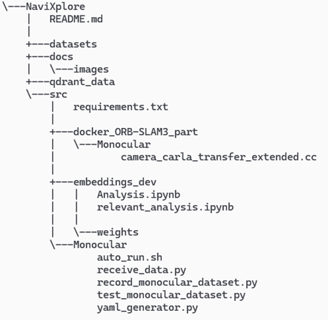

# NaviXplore 1.0
NaviXplore 1.0 – фреймворк для навигации транспортных средств в условиях неустойчивого сигнала GPS на основе компьютерного зрения.

NaviXplore 1.0 позволяет записывать видеопоток данных из CARLA Simulator в выбранную директорию, отправлять собранные данные по протоколу TCP/IP в Docker контейнер с алгоритмом ORB-SLAM3, получить обработанные ORB-SLAM3 данные обратно с рассчитанными глобальными координатами точек пространства и камеры, сохранять полученные данные в векторную базу данных, запрашивать из векторной базы данных координаты по текущему кадру и корректировать их для более детерминированного поведения, а также формировать отчёт пройденной траектории с графиком пути и выводить отладочную информацию в терминалы каждой составляющей. Для удобства использования написан скрипт автоматического запуска на Bash, а также приведён код с анализом в .ipynb формате на Python. 

# Руководство пользователя
Руководство пользователя доступно по ссылке: [руководство пользователя](/docs/Руководство%20пользователя.md)

# Структура проекта
