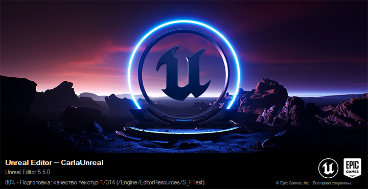
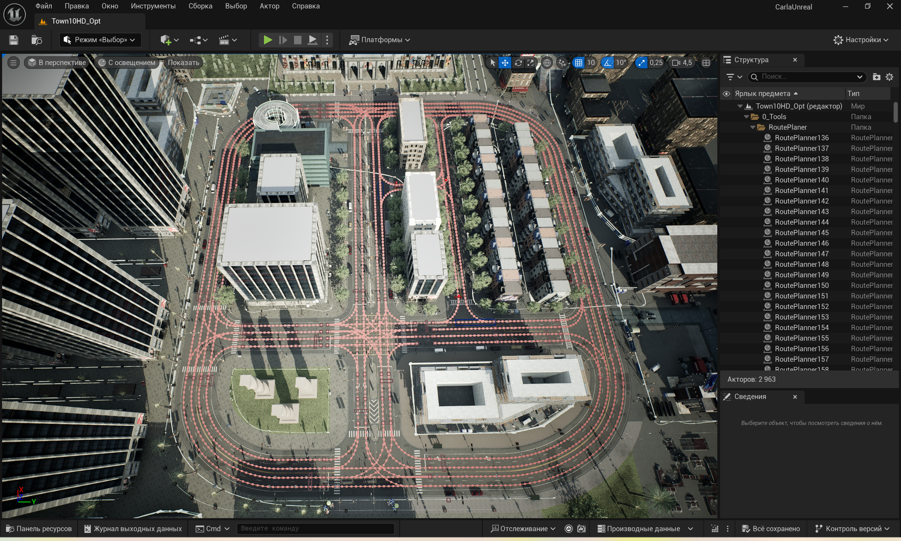
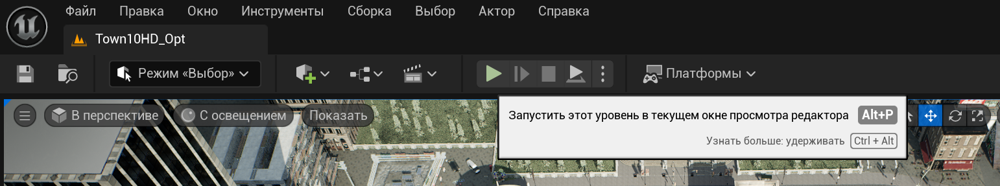
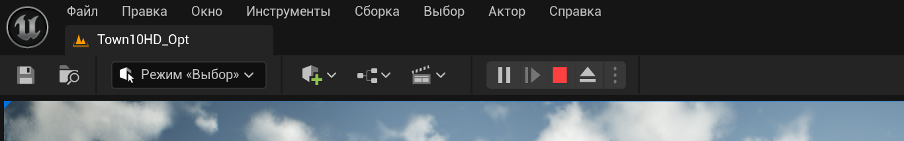

## Установка симулятора городской среды CARLA Simulator
Весь проект требует наличия на системном диске не менее 360 ГБ свободной памяти для Unreal Engine 5 сборки и видеокарты уровня не ниже RTX 3070.
Репозиторий: https://github.com/carla-simulator/carla
Документация: https://carla-ue5.readthedocs.io/en/latest/tuto_first_steps/
- Установка:
```Shell
git clone -b ue5-dev https://github.com/carla-simulator/carla.git CarlaUE5
```
- 
```Shell
cd CarlaUE5
CarlaSetup.bat
```
- На моменте установки Visual Studio 2022 необходимо изменить компоненты:

- Должны быть проставлены следующие галочки:

Без этого действия Unreal Engine не сможет запуститься.
В конце сборка в любом случае завершится ошибкой.
- Сначала в консоли "Developer Command Prompt for VS 2022" в директории репозитория нужно собрать проект с Python API:
```Shell
cmake --build Build --target carla-python-api-install
```
- Далее и для каждого последующего запуска так же в консоли VS 2022:
```Shell
cmake --build Build --target launch
```
Для управления окружением и последующей передачи данных куда угодно, нужно сначала запускать Unreal Engine через команду выше, а после через Python использовать нужные команды.

## Управление симулятором городской среды CARLA Simulator
- После выполнения команды запуска будет запущено окно загрузки редактора Unreal Engine 5:

- После успешной загрузки откроется основное окно редактора (всплывавющие окна можно закрыть):

- Чтобы включить интерактивный режим, нужно нажать на специальную кнопку, расположенную сверху окна, либо нажать комбинацию клавиш Alt+P:

- При запущенном симуляторе кнопка изменит свой вид:

Запуск происходит не сразу, необходимо некоторое время для загрузки текстур и материалов и прочих процессов редактора.

Перед запуском интерактивного режима управление камерой просхдодит через удержание правой кнопки мыши, после запуска - левой. Перемещение в пространстве - на клавиши W, A, S, D. Увеличение скорости движения - с помощью прокрутки колёсика мыши: вперёд - увеличение скорости, назад - уменьшение.

## Установка зависимостей проекта
Из-за особенностей API CARLA Simulator не получится корректно воспользоваться стандартным виртуальным окружением, которое создаётся через Python. Чтобы интерпретатор видел библиотеку carla, нужно использовать глобальный интерпретатор, а не тот, что находится в виртуальном окружении.

- Чтобы установить зависимости, необходимо выполнить команду, находясь в корневой директории репозитория:
```Shell
pip install -r src/requirements.txt
```

## Использовавние проекта
### Запись набора данных
Для записи датасета нужно, чтобы CARLA Simulator был запущен в интерактивном режиме.

- Команда для запуска записи:
```Shell
./record_monocular_dataset.py --output <Директория> --duration <Длительность в секундах>
```

Также, есть необязательные аргументы:
- **"--seed"**: заданный сид, если нужно детерминированное повведение.  
  Тип: целочисленный.  
  По-умолчанию - текущее время через команду time.time().
- **"--filterv"**: модель транспорта. Узнать доступные модели можно в документации CARLA Simulator.  
  Тип: строковый.  
  По-умолчанию: "vehicle.dodge.charger".
- **"--host"**: IP-адрес CARLA сервера.
  Тип: строковый.
  По-умолчанию: 127.0.0.1".
- **"--port"**: порт CARLA сервера.  
  Тип: целочисленный.  
  По-умолчанию: 2000.
- **"--tm-port"**: порт Traffic Manager. Подробнее про Traffic Manager можно узнать в документации CARLA Simulator.  
  Тип: целочисленный.  
  По-умолчанию: 8000.
- **"--preview"**: включить окно предпросмотра из камеры.  
- Тип: логический (True/False).  
  По-умолчанию: True.
- **"--speed"**: скорость движения в процентах (100% - нормальная, 50% - половина).  
  Тип: число с плавающей точкой.  
  По-умолчанию: 100.0.

После успешной записи датасета появится директория с заданным названием, внутри которой будут находиться:
- Директория "images" с изображениями. У каждого изображение название в наносекундах с 1 января 1970 года, 00:00:00 по всемирному координированному времени (UTC).
- Файл "timestamps.txt" с метками времени. Метки хранятся последовательно, начиная с новой строки, каждая метка соответствует названию изображения в директории "images".
-  Конфигурационный файл "carla.yaml" в формате, необходимом для ORB-SLAM3.

### Подача набора данных
- Для воспроизведения датасета нужно выполнить следующую команду:
```Shell
./test_monocular_dataset.py --dataset <Директория>
```

Также, есть необязательные аргументы:
- **"--port"**: порт для ZMQ PUB сокета.  
  Тип: целочисленный.  
  По-умолчанию: 5555.
- **"--speed"**: множитель скорости воспроизведения.  
        Тип: число с плавающей точкой.  
        По-умолчанию: 1.0.
- **"--loop"**: повторять воспроизведение по кругу.  
  Тип: логический (True/False).  
  По-умолчанию: True.